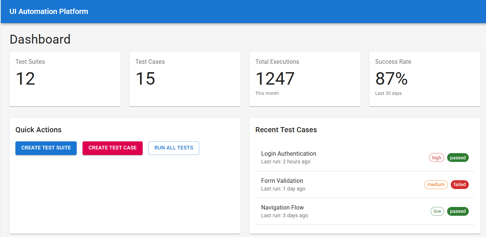
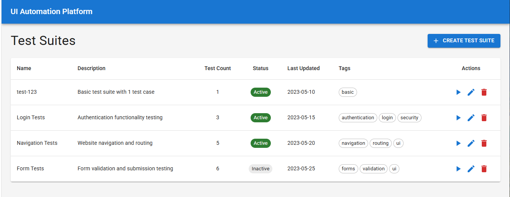
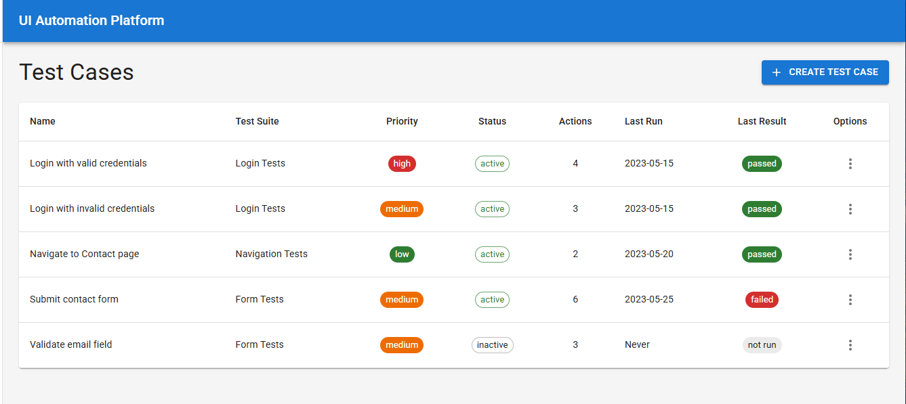

# UI Automation Platform

A comprehensive low-code/no-code UI automation testing platform built with React frontend and Node.js backend. Create, manage, and execute automated test cases with an intuitive drag-and-drop interface.

## 🚀 Features

### Test Management
- **Test Suites**: Organize your tests into logical groups
- **Test Cases**: Create detailed test scenarios with multiple actions
- **Action Library**: Pre-built actions for common UI interactions
- **Execution History**: Track test runs with detailed logs and results

### Test Execution
- **Cypress Integration**: Powered by Cypress for reliable test execution
- **Multiple Browser Support**: Run tests in Chrome, Firefox, Edge, and more
- **Headed/Headless Modes**: Choose between visible browser execution or background runs
- **Real-time Logs**: View execution progress and detailed error messages

### User Interface
- **Modern Design**: Clean, intuitive interface built with Material-UI
- **Drag & Drop**: Easy test creation with drag-and-drop actions (now click-to-add)
- **Real-time Updates**: Live updates of test execution status
- **Responsive Layout**: Works seamlessly across different screen sizes

## 📸 Screenshots







### Dashboard Overview
*Main dashboard showing test suites, test cases, and execution statistics*
- 12 Test Suites with organized categorization
- 15 Test Cases across all suites  
- 1247 Total Executions this month
- 87% Success Rate over last 30 days
- Quick Actions for creating test suites and test cases
- Recent Test Cases list with priority indicators

### Test Suites Management
*Manage your test collections with tags and status tracking*
- **test-123**: Basic test suite with 1 test case
- **Login Tests**: Authentication functionality testing
- **Navigation Tests**: Website navigation and routing
- **Form Tests**: Form validation and submission testing
- Each suite shows status, test count, and last updated date
- Tag-based categorization (authentication, login, security, navigation, routing, ui)

### Test Case Editor
*Visual test case editor with action library and workflow builder*
- **Test Workflow Panel**: 
  - Navigate action to https://www.orangehrm.com/
  - Click Element action targeting Contact Sales button
  - Assert action for form validation
- **Action Library Panel**:
  - **Interaction Category**: Click Element, Type Text, Select Option, Hover
  - **Timing Category**: Wait actions
  - **Navigation Category**: Navigate actions
  - **Validation Category**: Assert actions
- Click-to-add functionality for easy test building
- Parameter configuration for each action

### Test Case Details & Execution
*Detailed view of test cases with execution options and history*
- **Test Case Information**: Name, description, priority, expected results
- **Actions Tab**: Shows all configured test steps with parameters
- **Expected Result Tab**: Test outcome expectations  
- **Execution History Tab**: Complete execution logs and results
- **Execute Dropdown**: 
  - Run Headless option for background execution
  - Run with Browser option for visible execution
- Real-time execution status and detailed logging

## 🛠 Technology Stack

### Frontend
- **React 18** with TypeScript
- **Material-UI (MUI)** for UI components
- **React Query** for data fetching and caching
- **Axios** for API communication

### Backend
- **Node.js** with Express.js
- **MySQL** for data persistence
- **AWS DynamoDB** support (configurable)
- **Joi** for request validation

### Test Runner
- **Cypress 15.0** for test execution
- **Custom CLI** for programmatic test execution
- **XPath Support** via cypress-xpath plugin

## 🏗 Architecture

```
├── frontend/           # React TypeScript application
│   ├── src/
│   │   ├── components/ # Reusable UI components
│   │   ├── pages/      # Application pages
│   │   └── services/   # API clients
├── backend/            # Node.js Express API
│   ├── models/         # Data models
│   ├── routes/         # API endpoints
│   └── config/         # Database configuration
├── test-runner/        # Cypress test execution engine
│   ├── cypress/        # Cypress configuration and specs
│   └── src/           # CLI and API client
└── database/           # Database schema and setup
```

## 🚀 Quick Start

### Prerequisites
- Node.js 18+ 
- MySQL 8.0+
- npm or yarn

### Installation

1. **Clone the repository**
   ```bash
   git clone https://github.com/pradpanda/low-code-no-code-ui-automation.git
   cd low-code-no-code-ui-automation
   ```

2. **Install dependencies**
   ```bash
   # Install root dependencies
   npm install
   
   # Install frontend dependencies
   cd frontend && npm install
   
   # Install backend dependencies
   cd ../backend && npm install
   
   # Install test runner dependencies
   cd ../test-runner && npm install
   ```

3. **Setup Database**
   ```bash
   # Create MySQL database
   mysql -u root -p
   CREATE DATABASE ui_automation_platform;
   
   # Import schema and sample data
   mysql -u root -p ui_automation_platform < database/setup.sql
   ```

4. **Configure Environment**
   ```bash
   # Backend configuration
   cd backend
   cp env.example .env
   # Edit .env with your database credentials
   ```

5. **Start the Application**
   ```bash
   # Start backend (from backend directory)
   npm start
   
   # Start frontend (from frontend directory) 
   cd ../frontend
   npm start
   ```

6. **Access the Application**
   - Frontend: http://localhost:3000
   - Backend API: http://localhost:5000
   - Health Check: http://localhost:5000/health

## 🎯 Usage

### Creating a Test Suite
1. Navigate to **Test Suites** from the sidebar
2. Click **"Create Test Suite"**
3. Enter name, description, and tags
4. Save your test suite

### Building Test Cases
1. Go to **Test Cases** or select a test suite
2. Click **"Create Test Case"** or edit existing one
3. Use the **Action Library** to add test steps:
   - **Navigate**: Go to URLs
   - **Click Element**: Interact with buttons, links
   - **Type Text**: Fill input fields
   - **Assert**: Validate page content
   - **Wait**: Add delays between actions

### Executing Tests
1. Open a test case
2. Click the **Execute** dropdown
3. Choose execution mode:
   - **Run Headless**: Background execution
   - **Run with Browser**: Visible browser execution
4. Monitor progress in real-time
5. View detailed results in **Execution History**

### Viewing Results
- **Execution History**: See all past test runs
- **Detailed Logs**: stdout/stderr from test execution
- **Screenshots**: Automatic capture on failures
- **Videos**: Full test execution recordings

## 🔧 Configuration

### Database Switching
The platform supports both MySQL and AWS DynamoDB:

```javascript
// backend/config/database.js
const DB_TYPE = process.env.DB_TYPE || 'mysql'; // 'mysql' or 'dynamodb'
```

### Environment Variables
```bash
# Database Configuration
DB_TYPE=mysql
DB_HOST=localhost
DB_PORT=3306
DB_USER=root
DB_PASSWORD=your_password
DB_NAME=ui_automation_platform

# AWS Configuration (if using DynamoDB)
AWS_REGION=us-east-1
AWS_ACCESS_KEY_ID=your_access_key
AWS_SECRET_ACCESS_KEY=your_secret_key
```

## 🧪 Test Runner CLI

Execute tests programmatically:

```bash
cd test-runner

# Run a specific test case
npm run run-test-case -- --test-case=15

# Run with custom browser
npm run run-test-case -- --test-case=15 --browser=firefox --headed

# Custom backend URL
npm run run-test-case -- --test-case=15 --backend-url=http://localhost:5000
```

## 📊 API Endpoints

### Test Suites
- `GET /api/test-suites` - List all test suites
- `POST /api/test-suites` - Create new test suite
- `GET /api/test-suites/:id` - Get test suite details
- `PUT /api/test-suites/:id` - Update test suite

### Test Cases  
- `GET /api/test-cases` - List all test cases
- `POST /api/test-cases` - Create new test case
- `GET /api/test-cases/:id` - Get test case details
- `PUT /api/test-cases/:id` - Update test case
- `POST /api/test-cases/:id/execute-cypress` - Execute test case

### Execution History
- `GET /api/test-cases/:id/execution-history` - Get execution history
- `GET /api/test-cases/:id/latest-execution` - Get latest execution result

## 🤝 Contributing

1. Fork the repository
2. Create a feature branch (`git checkout -b feature/amazing-feature`)
3. Commit your changes (`git commit -m 'Add amazing feature'`)
4. Push to the branch (`git push origin feature/amazing-feature`)
5. Open a Pull Request

## 📝 License

This project is licensed under the MIT License - see the [LICENSE](LICENSE) file for details.

## 🐛 Known Issues

- Assert actions require proper parameter configuration
- XPath selectors need `//` prefix for proper recognition
- Some Material-UI components may show TypeScript warnings

## 🔮 Future Enhancements

- [ ] AI-powered test generation using LLM models
- [ ] Self-healing test capabilities with automatic XPath updates
- [ ] Integration with ReportPortal for advanced reporting
- [ ] Support for mobile testing (Appium integration)
- [ ] Visual regression testing capabilities
- [ ] CI/CD pipeline integration templates

## 📞 Support

For issues, questions, or contributions, please:
1. Check existing [Issues](https://github.com/pradpanda/low-code-no-code-ui-automation/issues)
2. Create a new issue with detailed description
3. Join our community discussions

---

**Built with ❤️ by the UI Automation Team**
